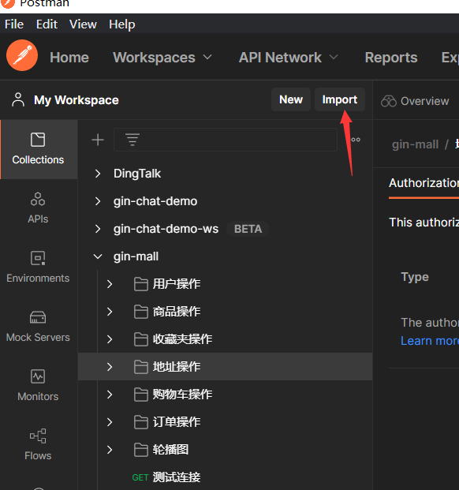

* 原项目地址: https://github.com/CocaineCong/micro-todoList

* 原项目教程: https://www.bilibili.com/video/BV1wz4y147EC


### 【My Readme】
* TODO: 这里每个服务一个目录, 显然在启动时会不方便!

* 【注意】RPC 开发在分布式事务这块, 只要保证单个服务原子性即可, 非要跨服务且要强一致性, 那就用异步队列!

* 【网关】web 虽然是对外提供接口, 但是也要注册到 rpc 中, 这样 web 代码里才能调用 rpc 的服务.
  * 一开始总觉得web不需要被注册到 etcd 中 - 这种理解是错误的.

* 【服务熔断】服务熔断（Circuit Breaker）的灵感来源于电路中的“保险丝”, 当某个远程服务频繁失败或响应过慢时, `熔断机制会“切断”对该服务的调用`, 避免故障扩散, `保护调用方`.

* 【服务降级】服务降级（Service Degradation）是指在系统压力大或依赖服务不可用时, `主动关闭或简化某些非核心功能`, 以保证核心业务的可用性.

* "一个接口要么成功, 要么失败" ——这是单体应用的正常视角. 但【熔断、降级】不是接口本身的逻辑, 而是`系统在复杂分布式环境下的“自我保护机制”`. 
	* 如何验证服务的熔断、降级, AI 建议用 sleep, 未尝试, 做个记录.

* 【中间件】gin 中间件提供了 cors 跨域、jwt 登录验证.

* 【RabbitMQ 异步队列】在 任务服务 模块被使用, 异步创建 task 数据.

* 【数据迁移】使用 gorm 提供的 `AutoMigrate` 根据模型结构体自动创建 mysql 表.

* 【Makefile】 是一个用于自动化构建项目的脚本文件, 常用于 C/C++ 项目, 但在 Go、Python 等项目中也广泛使用. 它由一系列`目标（target）`、`依赖（dependencies） `和 `命令（commands） `组成, 通过 `make <target>` 命令来执行对应的任务.
  * 当前项目 Makefile 文件的命令和任务如下
	```shell
	make proto		编译 .proto 文件生成 pb 代码
	make proto2	给生成的 pb 结构体注入标签（如 gorm、json）
	make gateway	构建并运行 gateway 服务
	make user		构建并运行 user 服务
	make run		并行启动所有服务（开发调试用）
	make env-up	启动 Docker 依赖环境（如 MySQL、Redis）
	make env-down	停止 Docker 环境
	```

* 【启动网关、启动rpc服务】make 启动项目先放一边, 手动启动项目过程如下:
	* 脚本先启动web, 再启动rpc, web那边虽然一开始会rpc调用失败, 但后面会自动【服务发现】, 接口就能正常访问.
	```shell
	# 启动网关（http api接口）, 此时 postman 接口访问网关, 会报错("UserRegister RPC 调用失败")
	go run app\gateway\cmd\main.go
	
	# 启动 RPC 的用户服务, 触发 gorm 的 migration 创建 user 表
	go run app\user\cmd\main.go
	
	# 启动 RPC 的任务服务, 触发 gorm 的 migration 创建 task 表
	go run app\task\cmd\main.go
	```

* 【protobuf】: 
  * 不做测试, 知道以下流程.
  * 以及 proto 文件支持工具包【`@inject_tag`】方式给生成的结构体打 【tag】.
	```shell
	# 安装 protoc 编译器
	# Ubuntu/Debian:
	sudo apt install protobuf-compiler
	
	# 安装 Go 插件
	go install github.com/protocolbuffers/protobuf-go/cmd/protoc-gen-go@latest
	go install go-micro.dev/v4/cmd/protoc-gen-micro@latest
	
	# 安装【标签注入工具】
	go install github.com/favadi/protoc-go-inject-tag@latest
	```

* 【etcd】 客户端看到的注册服务效果: 【服务名称 - 服务的节点、IP - 每个服务方法 - 服务方法的请求结构 - 服务方法的响应结构】
  * 
	```json
	{
	  "name": "rpcUserService",
	  "version": "latest",
	  "metadata": null,
	  "nodes": [
	    {
	      "metadata": {
	        "broker": "http",
	        "protocol": "mucp",
	        "registry": "etcd",
	        "server": "mucp",
	        "transport": "http"
	      },
	      "id": "rpcUserService-a03319fc-9c80-4408-99f1-ca76351d77fc",
	      "address": "127.0.0.1:8082"
	    }
	  ],
	  "endpoints": [
	    {
	      "request": {
	        "name": "UserRequest",
	        "type": "UserRequest",
	        "values": [
	          {
	            "name": "user_name",
	            "type": "string",
	            "values": null
	          },
	          {
	            "name": "password",
	            "type": "string",
	            "values": null
	          },
	          {
	            "name": "password_confirm",
	            "type": "string",
	            "values": null
	          }
	        ]
	      },
	      "response": {
	        "name": "UserDetailResponse",
	        "type": "UserDetailResponse",
	        "values": [
	          {
	            "name": "user_detail",
	            "type": "UserModel",
	            "values": [
	              {
	                "name": "id",
	                "type": "uint32",
	                "values": null
	              },
	              {
	                "name": "user_name",
	                "type": "string",
	                "values": null
	              },
	              {
	                "name": "created_at",
	                "type": "int64",
	                "values": null
	              },
	              {
	                "name": "updated_at",
	                "type": "int64",
	                "values": null
	              },
	              {
	                "name": "deleted_at",
	                "type": "int64",
	                "values": null
	              }
	            ]
	          },
	          {
	            "name": "code",
	            "type": "uint32",
	            "values": null
	          }
	        ]
	      },
	      "metadata": {},
	      "name": "UserService.UserLogin"
	    },
	    {
	      "request": {
	        "name": "UserRequest",
	        "type": "UserRequest",
	        "values": [
	          {
	            "name": "user_name",
	            "type": "string",
	            "values": null
	          },
	          {
	            "name": "password",
	            "type": "string",
	            "values": null
	          },
	          {
	            "name": "password_confirm",
	            "type": "string",
	            "values": null
	          }
	        ]
	      },
	      "response": {
	        "name": "UserDetailResponse",
	        "type": "UserDetailResponse",
	        "values": [
	          {
	            "name": "user_detail",
	            "type": "UserModel",
	            "values": [
	              {
	                "name": "id",
	                "type": "uint32",
	                "values": null
	              },
	              {
	                "name": "user_name",
	                "type": "string",
	                "values": null
	              },
	              {
	                "name": "created_at",
	                "type": "int64",
	                "values": null
	              },
	              {
	                "name": "updated_at",
	                "type": "int64",
	                "values": null
	              },
	              {
	                "name": "deleted_at",
	                "type": "int64",
	                "values": null
	              }
	            ]
	          },
	          {
	            "name": "code",
	            "type": "uint32",
	            "values": null
	          }
	        ]
	      },
	      "metadata": {},
	      "name": "UserService.UserRegister"
	    }
	  ]
	}
	```


# 【以下是原作者 README】
# micro-todoList
# Go-Micro V4 + RabbitMQ 构造简单备忘录

将原项目的micro的v2升到v4，服务发现使用etcd，支持熔断机制，token验证，网关和各模块之间的rpc通信等

# 项目的详细博客地址

**[用户模块](https://blog.csdn.net/weixin_45304503/article/details/122286980)**

**[备忘录模块](https://blog.csdn.net/weixin_45304503/article/details/122301707)**

# 项目的视频介绍地址

[Go-Micro+RabbitMQ 构建简单备忘录](https://www.bilibili.com/video/BV1h44y1L7LN)

# 项目的主要功能介绍

- 用户注册登录 ( jwt-go鉴权 )
- 新增/删除/修改/查询 备忘录

# 项目主要依赖：

**Golang V1.18**

- Gin
- Gorm
- mysql
- go-micro
- protobuf
- grpc
- amqp
- ini
- hystrix
- jwt-go
- crypto

# 项目结构
## 1.micro_todolist 项目总体
```
micro-todolist/
├── app                   // 各个微服务
│   ├── gateway           // 网关
│   ├── task              // 任务模块微服务
│   └── user              // 用户模块微服务
├── bin                   // 编译后的二进制文件模块
├── config                // 配置文件
├── consts                // 定义的常量
├── doc                   // 接口文档
├── idl                   // protoc文件
│   └── pb                // 放置生成的pb文件
├── logs                  // 放置打印日志模块
├── pkg                   // 各种包
│   ├── ctl               // 用户操作
│   ├── e                 // 统一错误状态码
│   ├── logger            // 日志
│   └── util              // 各种工具、JWT等等..
└── types                 // 定义各种结构体
```

## 2.gateway 网关部分
```
gateway/
├── cmd                   // 启动入口
├── http                  // HTTP请求头
├── handler               // 视图层
├── logs                  // 放置打印日志模块
├── middleware            // 中间件
├── router                // http 路由模块
├── rpc                   // rpc 调用
└── wrappers              // 熔断
```

## 3.user && task 用户与任务模块
```
task/
├── cmd                   // 启动入口
├── service               // 业务服务
├── repository            // 持久层
│    ├── db               // 视图层
│    │    ├── dao         // 对数据库进行操作
│    │    └── model       // 定义数据库的模型
│    └── mq               // 放置 mq
├── script                // 监听 mq 的脚本
└── service               // 服务
```


`config/config.ini`文件，直接将 `config.ini.example-->config.ini` 就可以了
conf/config.ini 文件
```ini
[service]
AppMode = debug
HttpPort = :4000

[mysql]
Db = mysql
DbHost = 127.0.0.1
DbPort = 3306
DbUser = micro_todolist
DbPassWord = micro_todolist
DbName = micro_todolist
Charset = utf8mb4

[rabbitmq]
RabbitMQ = amqp
RabbitMQUser = guest
RabbitMQPassWord = guest
RabbitMQHost = localhost
RabbitMQPort = 5672

[etcd]
EtcdHost = localhost
EtcdPort = 2379

[server]
UserServiceAddress = 127.0.0.1:8082
TaskServiceAddress = 127.0.0.1:8083

[redis]
RedisHost = localhost
RedisPort = 6379
RedisPassword = micro_todolist
```


# 运行简要说明
1. 启动环境

```shell
make env-up
```

2. 运行服务

```shell
make run
```

**注意：**
1. 保证rabbitMQ开启状态
2. 保证etcd开启状态
3. 依次执行各模块下的main.go文件

**如果出错一定要注意打开etcd的keeper查看服务是否注册到etcd中！！**

# 导入接口文档

打开postman，点击导入



选择导入文件


效果


